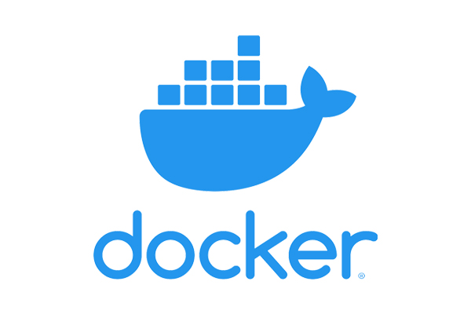

<!-- WIP -->

<h1 align="center">Projeto MySQL - One For All</h1>

 
  

<!-- TABLE OF CONTENTS -->
<h2 id="table-of-contents"> :book: Tabela de Conteúdos</h2>

  
Tabela de conteúdos

  <ol>
    <li><a href="#sobre"> ➤ Sobre o projeto</a></li>
    <li><a href="#tecnologias"> ➤ Tecnologias utilizadas</a></li>
    <li><a href="#descrição-do-projeto"> ➤ Descrição do projeto</a></li>
    <li><a href="#instruções"> ➤ Instruções</a></li>
    <li><a href="#requisitos"> ➤ Requisitos realizados </a></li>
    <li><a href="#requisito1"> ➤ Requisito 1: Criação de um banco de dados </a></li>
    <li><a href="#requisito2"> ➤ Requisito 2: Utilizando query para validar cancoes, artistas e albuns </a></li>
    <li><a href="#requisito3"> ➤ Requisito 3: Utilizando query para validar usuario, qtde_musicas_ouvidas e total_minutos </a></li>
    <li><a href="#requisito4"> ➤ Requisito 4: Utilizando query para filtrar os usuários ativos </a></li>
    <li><a href="#requisito5"> ➤ Requisito 5: Utilizando query para filtrar as músicas mais reproduzidas </a></li>
    <li><a href="#requisito6"> ➤ Requisito 6: Utilizando query para exibir o faturamento </a></li>
    <li><a href="#requisito7"> ➤ Requisito 7: Utilizando query para relacionar artista, album e seguidores </a></li>
    <li><a href="#requisito8"> ➤ Requisito 8: Utilizando query para relacionar artista e álbuns produzidos </a></li>
    <li><a href="#requisito9"> ➤ Requisito 9: Utilizando query para exibir a quantidade de músicas no histórico de um usuário </a></li>
    <li><a href="#requisito10"> ➤ Requisito 10: Utilizando query para exibir quantas vezes uma música foi reproduzida </a></li>
    <li><a href="#requisito11"> ➤ Requisito 11: Utilizando query para alterar o nome de músicas </a></li>
    <li><a href="#créditos"> ➤ Créditos </a></li>
  </ol>

<h2 id="sobre"> :pencil: Sobre o projeto </h2>

  
Projeto desenvolvido durante a formação de BackEnd na Trybe com o intuito de consolidar o aprendizado de Normalização de Tabelas, SQL e MySQL Workbench.

<h2 id="tecnologias"> :computer: Tecnologias utilizadas</h2>

  
  
  
  

<h2 id="descrição-do-projeto"> :page_facing_up: Descrição</h2>

  
Descrição
 
  Tem-se uma tabela não normalizada (`SpotifyClone-Non-NormalizedTable`) e uma série de requisitos com diferentes níveis de complexidade neste repositório.  
  
  Neste projeto eu realizei:
  
  <ol>
    <li>Normalização de tabela seguindo as três formas normais</li>
    <li>Criação de schema</li>
    <li>População do banco de dados</li>
    <li>Consolidação de conceitos e comandos de SQL no banco normalizado e populado;</li>
  </ol> 

  Durante o desenvolvimento foi utilizado Docker para evitar a restauração manual do banco de dados no MySQL Workbench. 
  Foram desenvolvidos os arquivos contendo apenas o comando necessário para resolver o requisito pedido.  

  <b>Regras de negócio para normalização da tabela:</b> 
  
  <ol>
    <li>Informações sobre quais planos estão disponíveis e seus detalhes</li>
    <ul>
      <li>Cada pessoa usuária pode possuir apenas um plano</li>
    </ul> 
    <li>Informações sobre todas as pessoas artistas</li>
    <ul>
      <li>Uma pessoa artista pode ter vários álbuns</li>
      <li>Uma pessoa artista pode ser seguida por várias pessoas usuárias</li>
    </ul> 
    <li>Informações sobre todos os álbuns de cada artista</li>
    <ul>
      <li>Para fins deste projeto, considere que cada álbum possui apenas uma pessoa artista como principal</li>
      <li>Cada álbum possui várias canções</li>
    </ul> 
    <li>Informações sobre todas as canções de cada álbum</li>
    <ul>
      <li>Para fins deste projeto, considere que cada canção está contida em apenas um álbum</li>
    </ul> 
    <li>Informações sobre todas as pessoas usuárias, seus planos, seu histórico de reprodução e pessoas artistas seguidas</li>
    <ul>
      <li>Uma pessoa usuária pode possuir apenas um plano</li>
      <li>Cada música do histórico de reprodução pode aparecer uma única vez por pessoa (o objetivo do histórico é saber quais canções já foram reproduzidas, independente do número de vezes)</li>
      <li>Uma pessoa usuária pode seguir várias pessoas artistas, mas cada pessoa artista pode ser seguida apenas uma vez por pessoa usuária</li>
    </ul> 
  </ol> 
  

<h2 id="instruções"> :scroll: Instruções</h2>

1. Clone o repositório
  * `git clone git@github.com:Gabrielle-Murat/MySQL-OneForAll.git`
  * Entre na pasta do repositório que você acabou de clonar;
 

2. Instale as dependências:
  * `npm install`
 

3. Como restaurar o banco de dados, se necessário:
  * Abra o MySQL Workbench,
  * Abra uma nova aba de query e cole dentro dela todo o conteúdo do arquivo `desafio1.sql`,
  * Execute a query e aguarde alguns segundos,
  * Atualize a lista de dbs;
 
  
4. Utilizando Docker:
  * Rode os serviços `node` e `db` com o comando `docker-compose up -d` (adapte a porta padrão, se necessário),
  * Com isso, serão inicializados dois containers: `one_for_all` e `one_for_all_db`
  * Use o comando `docker exec -it one_for_all bash` (para acessar o terminal interativo do container `one_for_all`),
  * As credenciais de acesso ao db estão definidas no arquivo `docker-compose.yml`, sendo acessíveis no container através das variáveis de ambiente          `MYSQL_USER` e `MYSQL_PASSWORD`
  * Instale as dependências com `npm install`
  * Todos os comandos disponíveis no `package.json` agora podem ser executados no terminal do container
 
    

<h2 id="requisitos"> :woman_technologist: Requisitos Realizados:</h2>

  
Criação do db:

  <h4 id="requisito1">Requisito 1: Criação de um banco de dados</h4>
  
    1. Criar um banco com o nome de `SpotifyClone` e um arquivo de configurações `desafio1.json`, que mapeará em qual tabela e coluna se encontram as informações necessárias para avaliação

 

  
Filtragem de dados:

  <h4 id="requisito2">Requisito 2: Utilizando query para validar cancoes, artistas e albuns</h4>
  
    2. Criar uma `QUERY` que exiba três colunas:
      2.1. A primeira coluna deve exibir a quantidade total de canções e, ter o alias `cancoes`.
      2.2. A segunda coluna deve exibir a quantidade total de artistas e, ter o alias `artistas`.
      2.3. A terceira coluna deve exibir a quantidade de álbuns e, ter o alias `albuns`.

  <h4 id="requisito3">Requisito 3: Utilizando query para validar usuario, qtde_musicas_ouvidas e total_minutos</h4>
  
    3. Criar uma `QUERY` que deverá ter apenas três colunas:
      3.1. A primeira coluna deve possuir o alias `usuario` e, exibir o nome da pessoa usuária.
      3.2. A segunda coluna deve possuir o alias `qtde_musicas_ouvidas` e, exibir a quantidade de músicas ouvida pela pessoa com base no seu histórico de reprodução.
      3.3. A terceira coluna deve possuir o alias `total_minutos` e, exibir a soma dos minutos ouvidos pela pessoa usuária com base no seu histórico de reprodução.
      3.4. Os resultados devem estar agrupados pelo nome da pessoa usuária e ordenados em ordem alfabética.

  <h4 id="requisito4">Requisito 4: Utilizando query para filtrar os usuários ativos</h4>
  
    4. Criar uma `QUERY` que deve mostrar as pessoas usuárias que estavam ativas no ano de <b>2021</b> se baseando na data mais recente no histórico de reprodução:
      4.1. A primeira coluna deve possuir o alias `usuario` e exibir o nome da pessoa usuária.
      4.2. A segunda coluna deve ter o alias `condicao_usuario` e exibir se a pessoa usuária está ativa ou inativa.
      4.3. O resultado deve estar ordenado em ordem alfabética.

  <h4 id="requisito5">Requisito 5: Utilizando query para filtrar as músicas mais reproduzidas</h4>
  
    5. Criar uma `QUERY` que possua duas colunas:
      5.1. A primeira coluna deve possuir o alias `cancao` e exibir o nome da canção.
      5.2. A segunda coluna deve possuir o alias `reproducoes` e exibir a quantidade de pessoas que já escutaram a canção em questão.
      5.3. O resultado deve estar ordenado em ordem decrescente, baseando-se no número de reproduções.
      5.4. Em caso de empate, ordenar os resultados pelo nome da canção em ordem alfabética.
      5.5. Busca-se apenas o top 2 de músicas mais tocadas.

  <h4 id="requisito6">Requisito 6: Utilizando query para exibir o faturamento</h4>
  
    6. Criar uma `QUERY` que deve exibir quatro dados, tendo como base o valor dos planos e o plano que cada usuário cadastrado possui no banco:
      6.1. A primeira coluna deve ter o alias `faturamento_minimo` e, exibir o menor valor de plano existente para um usuário.
      6.2. A segunda coluna deve ter o alias `faturamento_maximo` e, exibir o maior valor de plano existente para um usuário.
      6.3. A terceira coluna deve ter o alias `faturamento_medio` e, exibir o valor médio dos planos possuídos por usuários até o momento.
      6.4. A quarta coluna deve ter o alias `faturamento_total` e, exibir o valor total obtido com os planos possuídos por usuários.
      6.5. Deve-se arredondar o faturamento usando apenas duas casas decimais.

  <h4 id="requisito7">Requisito 7: Utilizando query para relacionar artista, album e seguidores</h4>
  
    7. Criar uma `QUERY` com as seguintes colunas, relacionando todos os álbuns produzidos por cada artista, com a quantidade de seguidores possuídos:
      7.1. A primeira coluna deve exibir o nome da pessoa artista, com o alias `artista`.
      7.2. A segunda coluna deve exibir o nome do álbum, com o alias `album`.
      7.3. A terceira coluna deve exibir a quantidade de seguidores que o artista possui e, deve possuir o alias `seguidores`.
      7.4. Os resultados devem estar ordenados de forma decrescente, baseando-se no número de seguidores.
      7.5. Em caso de empate no número de seguidores, ordenar os resultados pelo nome do artista em ordem alfabética.
      7.6. Caso haja artistas com o mesmo nome, ordenar os resultados pelo nome do álbum alfabeticamente.

  <h4 id="requisito8">Requisito 8: Utilizando query para relacionar artista e álbuns produzidos</h4>
  
    8. Criar uma `QUERY` que deve exibir as seguintes colunas, relacionando álbuns produzidos pelo artista `Walter Phoenix`:
      8.1. O nome da pessoa artista, com o alias `artista`.
      8.2. O nome do álbum, com o alias `album`.
      8.3. Os resultados devem ser ordenados pelo nome do álbum em ordem alfabética.

  <h4 id="requisito9">Requisito 9: Utilizando query para exibir a quantidade de músicas no histórico de um usuário</h4>
  
    9. Criar uma `QUERY` que deve exibir a quantidade de músicas que presentes no histórico de reprodução do usuário Bill:
      9.1. O valor da quantidade, com o alias `quantidade_musicas_no_historico`.

  <h4 id="requisito10">Requisito 10: Utilizando query para exibir quantas vezes uma música foi reproduzida</h4>
  
    10. Criar uma `QUERY` que deve exibir o nome e a quantidade de vezes que cada canção foi tocada por usuários do plano gratuito ou pessoal:
      10.1. A primeira coluna deve exibir o nome da canção, com o alias `nome`.
      10.2. A segunda coluna deve exibir a quantidade de pessoas que já escutaram aquela canção, com o alias `reproducoes`.
      10.3. Os resultados devem estar agrupados pelo nome da canção e ordenados em ordem alfabética.

 

  
Manipulação de dados:

  <h4 id="requisito11">Requisito 11: Utilizando query para alterar o nome de músicas</h4>
  
    11. Criar uma `QUERY` que deve alterar o nome de algumas músicas e as ordene segundo os critérios abaixo:
      11.1. A primeira coluna deve exibir o nome da música em seu estado normal com o alias `nome_musica`
      11.2. A segunda coluna deve exibir o nome da música atualizado com o alias `novo_nome`
      11.3. Trocar a palavra `Streets` no final do nome de uma música por `Code Review`
      11.4. Trocar a palavra `Her Own` no final do nome de uma música por `Trybe`
      11.5. Trocar a palavra `Inner Fire` no final do nome de uma música por `Project`
      11.6. Trocar a palavra `Silly` no final do nome de uma música por `Nice`
      11.7. Trocar a palavra `Circus` no final do nome de uma música por `Pull Request`
  

 

<h2 id="créditos"> 💳 Créditos</h2>

Tabela não normalizada (SpotifyClone-Non-NormalizedTable) e docker compose (docker-compose.yml) fornecidos pela Trybe.

